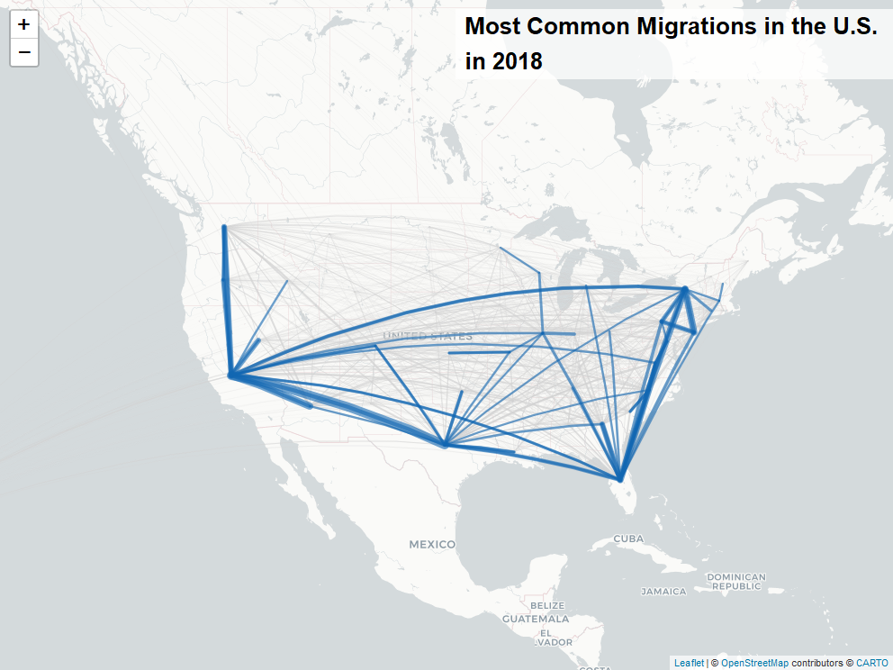

<!-- README.md is generated from README.Rmd. Please edit that file -->

# Migration data

This repo houses an in-progress piece of data
visualisation/journalism/art related to the U.S. Census data on
migration. It uses 2018 migration data to explore annual trends in where
Americans are moving within the country. The original data was
downloaded here:

<https://www.census.gov/data/tables/time-series/demo/geographic-mobility/state-to-state-migration.html>

The repo contains a cleaned version of the dataset, as well as an `.rda`
file with latitudes and longtitudes for centers of states for the
mapping.

# Maps

The repo contains a base script with a few various leaflet maps created
in the reporting, e.g.:

# Scrolly telling

The `scrolly` subdirectory has a shiny application displaying the the
piece of scrolly telling. The functionality to detect scroll by the user
and update the map based on scroll was taken from a John Coene blogpost
on scrollytelling in R. The repo with that blogpost and the
dependencies for this to be reproducible are found here:

<https://github.com/JohnCoene/scrollytell>

The final product is here:

<https://willdebras.shinyapps.io/migration_2018/>
